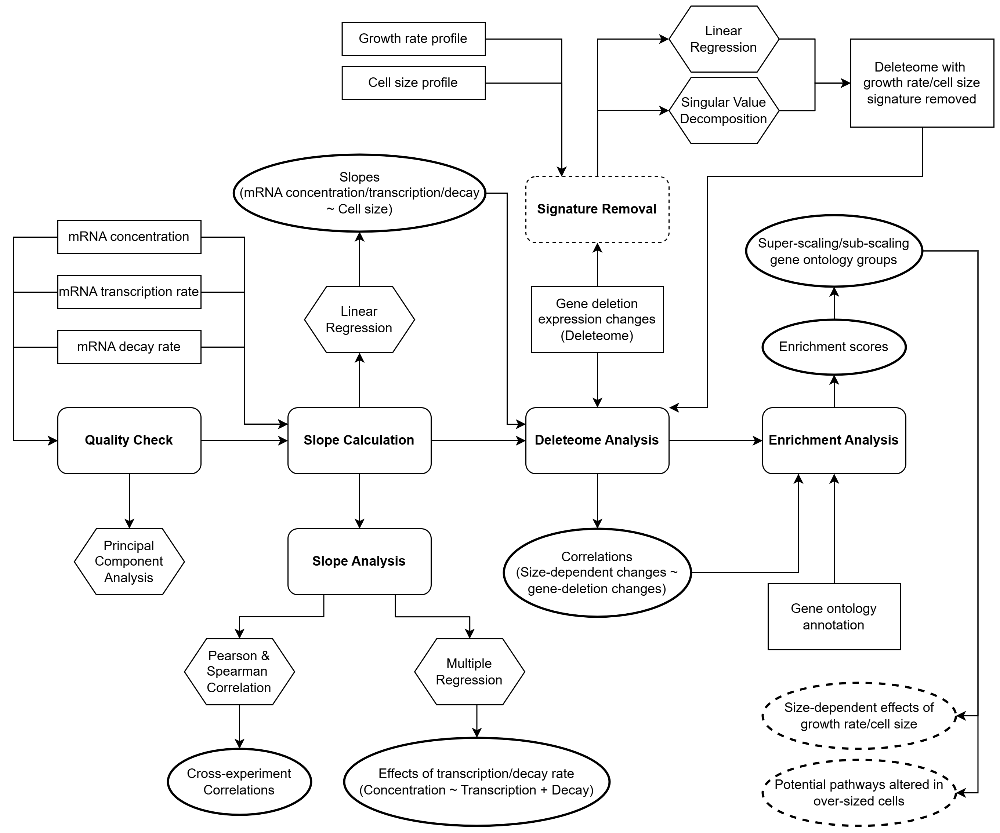

# Investigating Gene Expression Changes due to Cell Size

This repository contains the analysis pipeline (R Markdown scripts) from my master's thesis, which investigated how **cell size influences gene expression** in *Saccharomyces cerevisiae* (budding yeast) by integrating multi-omic functional genomics datasets, including **RNA-seq**, **ChIP-seq**, **mRNA decay**, **gene deletion**, and **growth rate** data, to uncover potential pathways that are transcriptionally modulated by cell size.

---

## Disclaimer

The scripts were developed by **Maya Hua** under the supervision of **Dr Matthew Swaffer**.
- The results generated by these scripts may be used in our future publications. 
- This repository is intended for **demonstration purposes** and may not represent the final version of the analysis pipeline.
- For further details about the code, please refer to my [thesis report](MSc_Thesis_MHua.pdf).

**Usage Terms:** See [Usage & Citation](#Usage--citation) below.

---

## Pipeline Overview



1. **Data processing:** Transfomation and harmonization for RNA, ChIP, and decay datasets.
2. **Quality check:** Principal Component Analysis (PCA) and correlation analyses on filtered datasets.
3. **Size slope calculation:** Linear regression of log transformed gene expression (TPM/RPKM) vs. cell size.
4. **Cross-dataset correlations:** Compare RNA, ChIP, and decay slopes across different experimental setups.
5. **Confounder Removal:** Regress out cell size and growth rate signatures from the deleteome data.
6. **Integration with deleteome:** Correlate gene deletions to size-dependent changes.
7. **Functional enrichment analysis:** Identify gene sets altered in different cell sizes.

---

## Dependencies

The pipeline is implemented in **R (v4.3.3)**. Key packages include:

* `ggplot2`, `patchwork` : data visualization
* `dplyr`, `tidyr`, `readr` : data wrangling
* `MASS` : linear models
* `Hmisc`, `corrr` : correlations
* `mitch` : multi-contrast enrichment analysis

Additionally, 5 custom functions are defined in the file 'functions.Rmd' for reuse across scripts.

---

## Input Data Sources

Due to size restrictions, raw datasets are **not included**. You can access the datasets from the following sources:

* Size-dependent mRNA expression datasets: Please [contact](#contacts) project supervisor
* Deleteome: [Kemmeren et al. (2014)](https://doi.org/10.1016/j.cell.2014.02.054)
  * [Raw expression data](https://deleteome.holstegelab.nl/data/downloads/deleteome_all_mutants_controls.txt)
  * [SVD-transformed data](https://deleteome.holstegelab.nl/data/downloads/deleteome_all_mutants_svd_transformed.txt)
* Growth rate profiles: [O’Duibhir et al. (2014)](https://doi.org/10.15252/msb.20145172)  [(Supplementary Dataset S2)](https://www.embopress.org/doi/suppl/10.15252/msb.20145172/suppl_file/msb145172-sup-0011-datasets2.zip)
* Cell size profiles: [Soifer & Barkai (2014)](https://doi.org/10.15252/msb.20145345)  [(Supplementary Dataset S1)](https://www.embopress.org/doi/suppl/10.15252/msb.20145345/suppl_file/msb145345-sup-0010-datasets1.xlsx)
* Gene Ontology annotations: [Saccharomyces Genome Database](https://www.yeastgenome.org/)

Place downloaded files into the corresponding `input_tables/` subfolders as outlined in the [file structure](#file-structure--pipeline-workflow) below.

---

## File Structure & Pipeline Workflow

The pipeline is constructed by 11 R mark down files. Scripts should be executed in the ascending order indicated by the numeric prefixes.

### Repository structure:

```
.
├── 0_r_functions/
│   └── functions.Rmd
│
├── 1_data_processing/
│   ├── G1_arrest_RNA/
│   │   └── scripts/G1-arrest_RNA.Rmd
│   ├── decay/
│   │   └── scripts/decay.Rmd
│   ├── elutriation_arrest_ChIP/
│   │   └── scripts/elutriation-arrest_ChIP.Rmd
│   ├── elutriation_arrest_RNA/
│   │   └── scripts/elutriation-arrest_RNA.Rmd
│   ├── size_mutants_ChIP/
│   │   └── scripts/size-mutants_ChIP.Rmd
│   └── size_mutants_RNA/
│       └── scripts/size-mutants_RNA.Rmd
│
├── 2_size_slopes/
│   └── scripts/slope_compare.Rmd
│
├── 3_deleteome_analysis/
│   └── scripts/
│       ├── 1_deleteome.Rmd
│       ├── 2_enrichment.Rmd
│       └── match_gene.Rmd
│
├── MSc_Thesis_MHua.pdf
│
├── pipeline_workflow.png
│
└── README.txt
```


<details>
<summary><h3>Full structure (including inputs and outputs):</h3> <i>Click to expand</i></summary>

```
.
├── 0_r_functions/
│   ├── functions.Rmd
│   └── functions.rda
│
├── 1_data_processing
│   ├── G1_arrest_RNA
│   │   ├── figures
│   │   │   ├── PC1-v-size_G1-arrest_RNA.svg
│   │   │   ├── pearson-heatmap_G1-arrest_RNA.svg
│   │   │   ├── sample_G1-arrest_RNA.svg
│   │   │   └── slope-v-PC1_G1-arrest_RNA.svg
│   │   ├── input_tables
│   │   │   ├── 210601_gene_annotation.txt
│   │   │   ├── 230128_verified_ORF.txt
│   │   │   ├── express-1.5.1.Candida+cerevisiae.2x50mers.TPM_with_both_names.table.txt
│   │   │   └── sample_info.txt
│   │   └── scripts
│   │       └── G1-arrest_RNA.Rmd
│   ├── decay
│   │   ├── input_tables
│   │   │   ├── 2230128verifiedORF.txt
│   │   │   ├── experiment_info.txt
│   │   │   ├── express-1.5.1.pombe+cerevisiae.2x50mers.TPM.SPBC.table.txt
│   │   │   └── sample_info.txt
│   │   ├── output_tables
│   │   │   ├── EU-pulse-chase-experiments_df_sc_240127.txt
│   │   │   └── MS240526_decay_rates_weights_bg_sub_p_-0.4.txt
│   │   └── scripts
│   │       └── decay.Rmd
│   ├── elutriation_arrest_ChIP
│   │   ├── figures
│   │   │   ├── PC1-v-size_elutriation-arrest_ChIP_Rpb1.svg
│   │   │   ├── pearson-heatmap_elutriation-arrest_ChIP_Rpb1.svg
│   │   │   └── slope-v-PC1_elutriation-arrest_ChIP.svg
│   │   ├── input_tables
│   │   │   ├── genes.with_multimappers.nochrM.ERMTOC.fragmentMidPoint.sacCer3.RPKM.table.txt
│   │   │   └── sample_info.txt
│   │   └── scripts
│   │       └── elutriation-arrest_ChIP.Rmd
│   ├── elutriation_arrest_RNA
│   │   ├── figures
│   │   │   ├── PC1-v-size_elutriation-arrest_RNA.svg
│   │   │   ├── haploid_slope-v-PC1_elutriation-arrest_RNA.svg
│   │   │   ├── pearson-heatmap_elutriation-arrest_RNA.svg
│   │   │   └── sample_elutriation-arrest_RNA.svg
│   │   ├── input_tables
│   │   │   ├── 210601_gene_annotation.txt
│   │   │   ├── 230128_verified_ORF.txt
│   │   │   ├── express-1.5.1.Candida+cerevisiae.2x50mers.TPM_with_both_names.table.txt
│   │   │   └── sample_info.txt
│   │   └── scripts
│   │       └── elutriation-arrest_RNA.Rmd
│   ├── size_mutants_ChIP
│   │   ├── figures
│   │   │   ├── PC1-v-size_size-mutants_ChIP.svg
│   │   │   ├── pearson_heatmap_size-mutants_ChIP.svg
│   │   │   └── slope-v-PC1_size-mutants_ChIP.svg
│   │   ├── input_tables
│   │   │   ├── exp180711-12_exp180222-27_genes.with_multimappers.nochrM.ERMTOC.fragmentMidPoint.sacCer3.RPKM.table.txt
│   │   │   └── sample_info.txt
│   │   └── scripts
│   │       └── size-mutants_ChIP.Rmd
│   └── size_mutants_RNA
│       ├── figures
│       │   ├── PC1-v-size_size-mutants_RNA.svg
│       │   ├── pearson_heatmap_size-mutants_RNA.svg
│       │   ├── sample_size-mutants_RNA.svg
│       │   └── slope-v-PC1_size-mutants_RNA.svg
│       ├── input_tables
│       │   ├── 210601_gene_annotation.txt
│       │   ├── 230128_verified_ORF.txt
│       │   ├── express-1.5.1.Candida+cerevisiae.2x50mers.TPM_with_both_names.table.txt
│       │   └── sample_info.txt
│       └── scripts
│           └── size-mutants_RNA.Rmd
│
├── 2_size_slopes
│   ├── figures
│   │   ├── plot_corr_arrest_pooled_pearson.svg
│   │   ├── plot_corr_arrest_pooled_spearman.svg
│   │   ├── plot_corr_elutriation_pearson.svg
│   │   ├── plot_corr_elutriation_spearman.svg
│   │   ├── plot_corr_size_mutants_pearson.svg
│   │   ├── plot_corr_size_mutants_pooled_pearson.svg
│   │   ├── plot_corr_size_mutants_pooled_spearman.svg
│   │   └── plot_corr_size_mutants_spearman.svg
│   ├── input_tables
│   │   ├── G1-arrest_RNA_slopes.txt
│   │   ├── elutriation-arrest_ChIP_slopes.txt
│   │   ├── elutriation-arrest_RNA_slopes.txt
│   │   ├── half_lives_fold_change.txt
│   │   ├── size-mutants_ChIP_slopes.txt
│   │   └── size-mutants_RNA_slopes.txt
│   ├── output_tables
│   │   ├── regression.txt
│   │   └── slopes_combined.txt
│   └── scripts
│       └── slope_compare.Rmd
│
├── 3_deleteome_analysis
│   ├── figures
│   │   ├── deleteome_annotated_enrichment_plot.svg
│   │   ├── deleteome_annotated_enrichment_plot_growth-rm.svg
│   │   ├── deleteome_annotated_enrichment_plot_growth-size-rm.svg
│   │   ├── deleteome_annotated_enrichment_plot_svd-rm.svg
│   │   ├── deleteome_annotated_enrichment_plot_svd-size-rm.svg
│   │   ├── deleteome_correlation.svg
│   │   ├── deleteome_correlation_growth-rm.svg
│   │   ├── deleteome_correlation_growth-rm_vs_cell_size.svg
│   │   ├── deleteome_correlation_growth-rm_vs_growth_rate.svg
│   │   ├── deleteome_correlation_growth-size-rm.svg
│   │   ├── deleteome_correlation_growth-size-rm_vs_cell_size.svg
│   │   ├── deleteome_correlation_svd-rm.svg
│   │   ├── deleteome_correlation_svd-rm_vs_cell_size.svg
│   │   ├── deleteome_correlation_svd-rm_vs_growth_rate.svg
│   │   ├── deleteome_correlation_svd-size-rm.svg
│   │   ├── deleteome_correlation_svd-size-rm_vs_cell_size.svg
│   │   ├── deleteome_correlation_vs_cell_size.svg
│   │   ├── deleteome_correlation_vs_growth_rate.svg
│   │   ├── deleteome_heatmap.svg
│   │   ├── deleteome_heatmap_growth-rm.svg
│   │   ├── deleteome_heatmap_growth-size-rm.svg
│   │   ├── deleteome_heatmap_svd-rm.svg
│   │   └── deleteome_heatmap_svd-size-rm.svg
│   ├── input_tables
│   │   ├── SGD_GO_annotations.tsv
│   │   ├── deleteome_all_mutants_controls.txt
│   │   ├── deleteome_all_mutants_svd_transformed.txt
│   │   ├── deleteome_index.txt
│   │   ├── deleteome_mutants_information.xlsx
│   │   ├── growth_rate.txt
│   │   └── soifer_2014_dataset_s1.txt
│   ├── output_tables
│   │   ├── deleteome_correlation.txt
│   │   ├── deleteome_correlation_growth-rm.txt
│   │   ├── deleteome_correlation_growth-size-rm.txt
│   │   ├── deleteome_correlation_svd-rm.txt
│   │   ├── deleteome_correlation_svd-size-rm.txt
│   │   ├── deleteome_enrichment_report.html
│   │   ├── deleteome_enrichment_report_growth-rm.html
│   │   ├── deleteome_enrichment_report_growth-size-rm.html
│   │   ├── deleteome_enrichment_report_svd-rm.html
│   │   ├── deleteome_enrichment_report_svd-size-rm.html
│   │   ├── deleteome_enrichment_result.txt
│   │   ├── deleteome_enrichment_result_combined.txt
│   │   ├── deleteome_enrichment_result_growth-rm.txt
│   │   ├── deleteome_enrichment_result_growth-size-rm.txt
│   │   ├── deleteome_enrichment_result_svd-rm.txt
│   │   ├── deleteome_enrichment_result_svd-size-rm.txt
│   │   └── filtered_gene_sets.txt
│   └── scripts
│       ├── 1_deleteome.Rmd
│       ├── 2_enrichment.Rmd
│       └── match_gene.Rmd
│
├── MSc_Thesis_MHua.pdf
│
├── pipeline_workflow.png
│
└── README.txt
```
</details>

### Pipeline workfow

#### `0_r_functions/`

Contains 5 custom functions used repeatedly in the pipeline.

* **Script functionality:**

  * Define helper functions for data import, size slope calculation, and plotting.
  * Running the script compiles all functions into an `.rda` file that can be imported into downstream scripts.

* **Output:**

  * `functions.rda`

#### `1_data_processing/`

RNA, ChIP, and decay rate data processing, with scripts and folders following the naming format: `Experiment_SequencingMethod`.

* **Inputs:**

  * 7 datasets from 3 experiments measuring global mRNA abundance, mRNA transcription rates, and mRNA turnover rates across different cell sizes.
  * Corresponding experiment/sample metadata.
  * Verified open reading frames (ORFs) of *S. cerevisiae*.

* **Scripts functionality:**

  * **Transformation & harmonization:** Normalize and align RNA, ChIP, and decay datasets to a unified format.
  * **Feature filtering:** Filter genes and samples based on quality and coverage thresholds.
  * **Exploratory analysis:** Perform PCA and compute pairwise correlations among strains within each dataset.
  * **Size slope calculation:** Compute gene-wise regression slopes of expression against cell size.

* **Outputs:**

  * Processed datasets
  * Correlation heatmaps
  * PC1 vs. size slope scatter plots

#### `2_size_slopes/`

Integrates and analyses size-dependent expression slopes.

* **Inputs:**

  * Size slope results generated in `1_data_processing/`.

* **Scripts functionality:**

  * **Integration:** Combine slope data across RNA, ChIP, and decay experiments.
  * **Correlation analysis:** Evaluate relationships between size slopes across different datasets.
  * **Multiple regression analysis:** Model the effects of transcription and decay rates on size-dependent variations in mRNA levels.

* **Outputs:**

  * Combined size slope table (all experiments)
  * Regression results summary table
  * Heatmaps and scatter plots

#### `3_deleteome_analysis/`

Deleteome correlation and confounder-adjusted functional analyses.

* **Inputs:**

  * Gene deletion (deleteome) datasets
  * Growth rate and cell size profiles
  * Gene ontology (GO) terms of *S. cerevisiae*

* **Scripts functionality:**

  * **Integration:** Merge deleteome, size slope, growth rate, and cell size data.
  * **Correlation analysis:** Assess how gene-deletion effects correlate with size-dependent transcriptional responses.
  * **Confounder adjustment:** Apply regression-based correction for growth rate and cell size effects.
  * **Functional enrichment:** Conduct multi-contrast functional enrichment analyses (GO) before and after confounder removal.

* **Outputs:**

  * Correlation tables and heatmaps
  * Enrichment reports
  * Enrichment score scatter plots and heatmaps

---

## Usage and Citation

These srcipts can be used for individual, academic, and research, but cannot be repackaged or sold without written permission. If you use or adapt these scripts in your own work, please include a reference to this repository (https://github.com/mayahua/Cell_Size).

---

## Contacts

- Code developed by: Maya Hua [📧](mailto:maya.hua@outlook.com) | MSc @ Univeristy of Edinburgh, BSc @ University of Bristol, looking for PhD opportunities in AI4Science or related industry roles.
- Supervisor: Dr Matthew Swaffer [📧](mailto:matthew.swaffer@ed.ac.uk)
